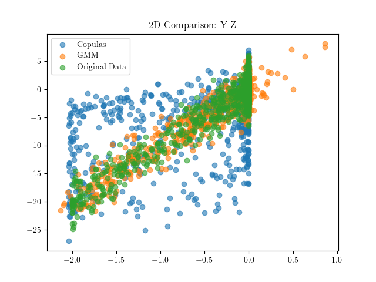
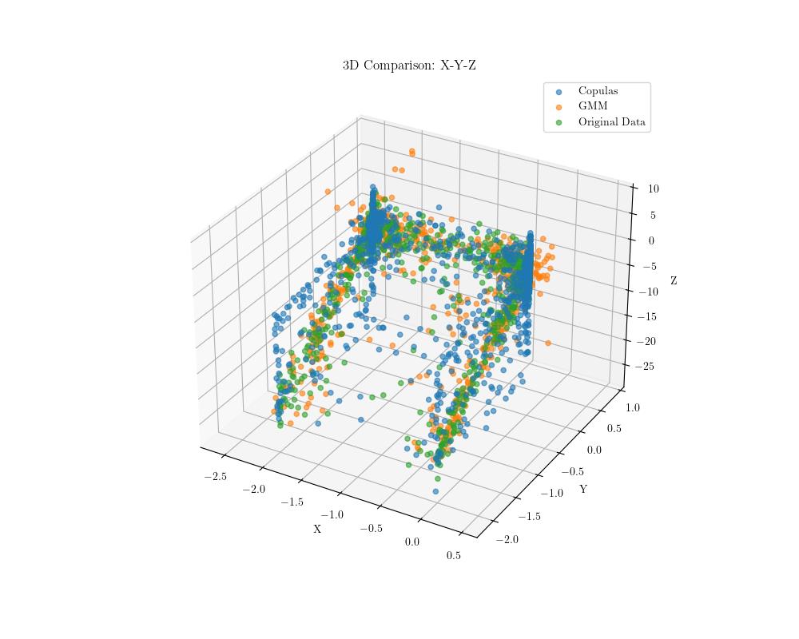

# Generating Synthetic Health Insurance Data Using Copulas

In the field of international health insurance, managing large amounts of data is essential for risk modeling and pricing. Insurance actors handle data from numerous international sources, which introduces challenges related to consistency, quality, and regulatory compliance. Additionally, this sensitive data requires strict confidentiality measures.

We will focus on generating synthetic data, an approach that allows the creation of realistic datasets without compromising data privacy. By using copula-based methods, particularly Gaussian copulas, we have been able to model complex dependencies between variables while reproducing the characteristics of the distributions observed in real data.

The generated synthetic data was evaluated using univariate and multivariate metric comparisons with real data, with a baseline based on Gaussian Mixture Models (GMM). The results indicate that the use of copulas, especially Gaussian copulas, enables the generation of synthetic data that reasonably reproduces dependency structures and certain properties of the original data. However, discrepancies were observed, highlighting the need for further exploration of these methods to improve their accuracy and ability to capture all nuances of real data.

This work was presented as a Master Thesis by Arsen Pidburachynskyi, supervised by Ho Mei Hung. The associated internship report can be found in the root directory: `report.pdf`.


The file structure is organized as follows:
```
.
├── README.md
├── images # Folder with images
├── copulas
```

This work was partly based on the open-sourced python library [Copulas](https://pypi.org/project/copulas/), for which we performed custom modifications detailed hereafter in the folder ```copulas```.

The main algorithm that we used for synthetic data generation is described with the following notations:

* $`n \in ℕ`$: the number of data points or observations. This represents the total size of the dataset we are working with. $d \in ℕ$ is the dimension of the data points, or the number of features. This indicates the number of variables or attributes each data point has. Each data point will be denotes as a tuple in the form $(x_1, \ldots, x_d) \in ℝ^{d}$: The individual features or attributes of a data point. Each $x_i$ represents a specific feature in the $d$-dimensional space. When considering the index $j$ of each $d$-tuple in the dataset, we will denote $y_j = (x_1^j, \ldots, x_d^j) \in ℝ^{d}$ and the corresponding dataset $`\mathscr{D} = \{ y_j \}_{j=1}^{n}`$.
* $\theta \in \Theta$ corresponds to the set of parameters for the parametric distribution model, belonging to the set $\Theta$ of plausible parameters. These parameters define the shape and other characteristics of the distribution.
* $`p_\theta(x_1, \ldots, x_d): ℝ^{d} \rightarrow ℝ_{+}`$: The estimated probability density function (PDF), which depends on the parameters $\theta$. This function represents the likelihood of observing a data point $(x_1, \ldots, x_d)$ given the parameters $\theta$. The empirical cumulative density function (CDF) associated to each of the variables $x_i$, $i \in \{1,\ldots,d\}$, when using $n$ samples will be denoted as $F_{i}^n$, and their estimations $F_{\theta_i}$. We will also denote the data log-likelihood as $\mathscr{L}(\theta ; \mathscr{D})$ which corresponds to the logarithm of the likelihood of the observations in the dataset when using parameter $\theta$. 

Fiting one-dimensional distributions is generally easy, but capturing a joint distribution is harder. This is where Copulas comes into play by allowing to model dependencies between univariates distributions. This is thanks to Sklar's Theorem (1959): For a a d-dimensional CDF, $F$, with marginals $F_1, \ldots, F_d$. Then there exists a copula, $C$, such that
$`F(x_1, \ldots, x_d)=C(F_1(x_1), \ldots, F_d(x_d))`$, for all $x_i \in[-\infty, \infty]$ and $i=1, \ldots, d$.

To estimate the copula function $C$, the following steps are taken:

 1. **Estimate the Marginal Distributions:** Estimate the marginal distributions $\hat{F}_1, \ldots, \hat{F}_d$ for each variable using the data.
 2. **Create Pseudo-Observations:** Use the estimated marginals to create pseudo-observations $\hat{U}_1 = \hat{F}_1(Z_1), \ldots, \hat{U}_d = \hat{F}_d(Z_d)$.
 3. **Estimate the Copula:** From these pseudo-observations, estimate the copula function $C$.

Once the copula $\hat{C}$ and the marginal distributions $\hat{F}_1, \ldots, \hat{F}_d$ are estimated, synthetic data can be generated by:

1. **Simulating Random Variables:** Generate random variables $U_1, \ldots, U_d$ from the estimated copula $\hat{C}$.
2. **Transforming Back to the Original Scale:** Convert these to the original data space using $Z_1 = \hat{F}_1^{-1}(U_1), \ldots, Z_d = \hat{F}_d^{-1}(U_d)$.

These steps allow for the creation of synthetic data that maintains both the marginal distributions and the dependence structure of the original data.

Is this work:

1. In our setup, $F_{\theta}$ is fitted using various families of distributions to capture the behavior of continuous variables effectively. These distributions include:

* **Beta Distributions** $\mathrm{Beta}(\alpha,\beta)$: Suitable for modeling variables within [0, 1].
* **Gamma Distributions** $\Gamma(\alpha, \beta)$: Used for skewed distributions.
* **Gaussian Kernel Density Estimation (KDE)**: Non-parametric density estimation.
* **Gaussian Distributions** $\mathcal{N}(\mu,\sigma^2)$: For normally distributed data.
* **Truncated Gaussian Distributions**: Gaussian distributions limited to a range.
* **Student's t Distributions**: For data with heavier tails.
* **Uniform Distributions**: Modeling equally likely outcomes within a range.
* **Log-Laplace Distributions** $LL(\mu,b)$: For log-normal behavior.
* **Exponential Distributions**: Modeling time until an event.
* **Levy Distributions**: For highly skewed data with heavy tails.

The first eight distributions are supported by the Copulas Library, while custom tests were implemented for the exponential and Levy distributions to broaden the scope of fitting options:

* The exponential distribution can be fitted using the `ExponentialUnivariate` class that is implemented in the `copulas/univariate/exponential.py` file.
* The Levy distribution can be fitted using the `LevyUnivariate` class that is implemented in the `copulas/univariate/levy.py` file.

Parameters for each distribution are estimated using Maximum Likelihood Estimation (MLE), which maximizes the likelihood of the observed data under the model.

2. We considered Gaussian copula, which are widely used and straightforward type of copula model. The Gaussian copula is based on the multivariate normal distribution and uses the probability integral transformation to model dependencies between random variables, given a specific covariance matrix, denoted as $\Sigma$. The Gaussian copula $C_{\text{Gauss}}^{\Sigma}(u)$ for a given covariance matrix $\Sigma$ is expressed for $u_1,\dots,u_d \in (0,1)^d$ as: $`C_{\text{Gauss}}^{\Sigma}(u) = \Phi_{\Sigma}(\Phi^{-1}(u_1), \ldots, \Phi^{-1}(u_d))`$, where $\Phi: s \in ℝ \mapsto \frac{1}{\sqrt{2 \pi}}\int_{- \infty}^{s} \exp(-\frac{t^{2}}{2}) \mathrm{d}t$ represents the cumulative distribution function (CDF) of the standard normal distribution $\mathcal{N}(0,1)$ and $\Phi_{\Sigma}$ is the joint CDF of a multivariate distribution $\mathcal{N}(\mathbf{0}_d,\Sigma)$.

# Further analysis with synthetic data

We include in the file `toy_data_generation.py` a script that attempts to reproduce some of the experiments with a toy synthetic dataset. 

In this synthetic dataset, we considered comparing a GMM with a Gaussian-Copulas. Here, the GMM was fitted with 27 modes, according to the Akaike Information Criterion (AIC).






The plots above show the 2D and 3D scatter plots of the original data (green), the Copulas-generated data (blue), and the GMM-generated data (orange). In X-Y and X-Z plots, it seems that the Copulas generates a better fit than the GMM, in particular in the upside square boundaries. However, in the Y-Z plot, it seems that the GMM produces a better fit than the Copulas. We believe that this is due to the fact that the Gaussian Copula is not able to capture the dependencies in the tail of the data. This warrants further investigation on the choice of copula; investigating other copulas than the Gaussian one, or even non-parametric copulas could be an interesting avenue of research.